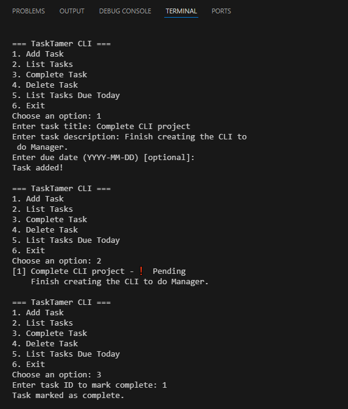

# 📝 TaskTamer - Python CLI To-Do List Manager

TaskTamer is a command-line to-do list application built with Python. It allows you to manage your daily tasks with ease — add, view, complete, and delete tasks right from your terminal. Tasks are saved between sessions using a JSON file, so nothing is lost when you quit.

---

## 🚀 Features

- Add new tasks with title, description, and optional due date
- View all saved tasks with status
- Mark tasks as completed
- Delete tasks by ID
- View tasks that are due today
- Persistent storage in `tasks.json`
- Simple and clean CLI experience

---

## 📂 Project Structure
python-cli-todo-app/
├── app.py # Main CLI logic
├── task.py # Task class
├── utils.py # Utility functions
├── tasks.json # Stored tasks
├── test_utils.py # Unit tests
└── README.md # Project info and instructions

---

## ▶️ How to Use

1. Open your terminal
2. Run the program: python app.py
3. Follow the on-screen menu:
   1. Add Task  
   2. List Tasks  
   3. Complete Task  
   4. Delete Task  
   5. List Tasks Due Today  
   6. Exit

---

## 🧪 Example

=== TaskTamer CLI ===  
1. Add Task  
2. List Tasks  
3. Complete Task  
4. Delete Task  
5. List Tasks Due Today  
6. Exit

Choose an option: 1  
Enter task title: Study  
Enter task description: Revise for Python exam  
Enter due date (YYYY-MM-DD) [optional]: 2025-06-20  
Task added!

## 📷 Screenshot

## 👤 Author
Created by Merlyn for a Python project at DirectEd.